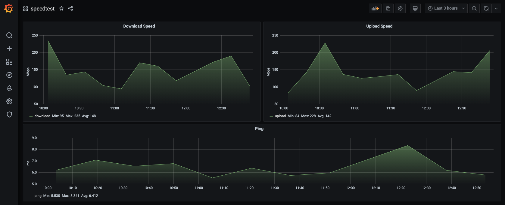

# GoOokla Speedtest to InfluxDB

this is a small golang app that will monitor continuously your internet speed with ookla speedtest and saves the  data to influxDB.

> WORK IN PROGRESS! this is a project to get in touch with golang

## TODOs

- [x] dockerfile and ready to use container
- [ ] support for influx < 1.8
- [x] documentation
- [x] grafana dashboards influx >= 1.8
- [ ] grafana dashboards influx < 1.8
- [ ] auto build 


## Usage

| Environment Variable 	| Description                                                      	| Default Value 	|
|----------------------	|------------------------------------------------------------------	|---------------	|
| SINK                 	| where the data should be sent. possible values: <br> **console, influxdbv1, influxdbv2** | console            |
| SERVER_ID             | ookla speedtest server id if you want to use always the same server for tests. if empty, speedtest will auto negotiate the nearest server                                | ""           |
| INTERVAL             |  wait between each speedtest in seconds                            | 900          |
| INFLUX_HOST            | **only for influxdb sinks** <br> influxdb host                            | http://localhost:8086         |
| INFLUX_V1_USER            | **only for influxdbv1 sink** <br> influxdb user to connect                          | ""        |
| INFLUX_V1_PASSWORD            | **only for influxdbv1 sink** <br> influxdb password to connect                           | ""        |
| INFLUX_V2_ORG            | **only for influxdbv2 sink** <br> organization for influxdb >= 1.8                         | "devlabs"        |
| INFLUX_V2_BUCKET          | **only for influxdbv2 sink** <br> data bucket for influxdb >= 1.8                         | "speedtest"        |
| INFLUX_V2_AUTHTOKEN         | **only for influxdbv2 sink** <br> auth token for influxdb >= 1.8                         | ""        |

## Grafana Dashboard

I created an example dashboard which you can use to display your data. 



**grafana dashboard for influxdb > 1.8:** [go to dashboard json](./third_party/grafana_dashboard_influxdbv2.json)

**grafana dashboard for influxdb <= 1.8:** comming soon

## Run it locally on docker

### build docker image locally

if you want to create the docker image by yourself you can do this like this:

```
docker build -t goookla -f ./build/Dockerfile .
```

### run image

run a new container like this with the minimal informations:

```bash
docker run -d \
--name goookla \ 
-e "SINK=<yourSink>" \
-e "INTERVAL=<interval in seconds>" \
-e "INFLUX_HOST=http://localhost:8086" \
-e "INFLUX_AUTHTOKEN=<your auth token>" \
aexer/goookla-influx:latest
```


